# Route, Controller, and View Mapping

This section details the connection between each route, its controller (if any), and the Blade view (if any) in this project.

| Route | Controller Used | View Used | Notes |
|-------|-----------------|-----------|-------|
| `/` | None | welcome.blade.php | Returns the default welcome view |
| `/hello` | None | None | Returns a simple string |
| `/hello2` | None | None | Returns a styled HTML string |
| `/hello/lpu` | None | None | Returns a string |
| `/hello/username/{name}` | None | None | Returns a string with parameter |
| `/hello/username/{name}/age/{age}` | None | None | Returns a string with parameters |
| `/hello/{a}/{b}` | None | None | Returns the sum as a string |
| `/hellotable/{number}` | None | None | Returns multiplication table as string |
| `/hello/courses` | None | None | Returns HTML list |
| `/helloresponse` | None | None | Returns plain text response |
| `/helloresponsejson` | None | None | Returns JSON response |
| `/helloresponsehtml` | None | None | Returns HTML response |
| `/hellodownload` | None | None | Returns file download |
| `/hellogoogle` | None | None | Redirects to Google |
| `/welcomeview` | None | welcomeview.blade.php | Returns custom welcome view |
| `/lpu/admin` | None | None | Redirects to `/lpu/student` |
| `/lpu/student` | None | student.blade.php | Returns student dashboard view |
| `/products` | None | product.blade.php | Returns product list view with data |
| `/controller/{name}` | mycontroller@show | None | Returns string from controller |

## Visual Map

```mermaid
graph TD
	Route1["/"] -- no controller, view: welcome.blade.php --> View1[welcome.blade.php]
	Route2["/hello"] -- no controller, returns string --> Output2[String]
	Route3["/hello2"] -- no controller, returns HTML string --> Output3[HTML String]
	Route4["/hello/lpu"] -- no controller, returns string --> Output4[String]
	Route5["/hello/username/{name}"] -- no controller, returns string --> Output5[String]
	Route6["/hello/username/{name}/age/{age}"] -- no controller, returns string --> Output6[String]
	Route7["/hello/{a}/{b}"] -- no controller, returns string --> Output7[String]
	Route8["/hellotable/{number}"] -- no controller, returns string --> Output8[String]
	Route9["/hello/courses"] -- no controller, returns HTML list --> Output9[HTML List]
	Route10["/helloresponse"] -- no controller, returns plain text --> Output10[Plain Text]
	Route11["/helloresponsejson"] -- no controller, returns JSON --> Output11[JSON]
	Route12["/helloresponsehtml"] -- no controller, returns HTML --> Output12[HTML]
	Route13["/hellodownload"] -- no controller, returns file --> Output13[File Download]
	Route14["/hellogoogle"] -- no controller, redirects --> Output14[Redirect]
	Route15["/welcomeview"] -- no controller, view: welcomeview.blade.php --> View2[welcomeview.blade.php]
	Route16["/lpu/admin"] -- no controller, redirects --> Output16[Redirect]
	Route17["/lpu/student"] -- no controller, view: student.blade.php --> View3[student.blade.php]
	Route18["/products"] -- no controller, view: product.blade.php --> View4[product.blade.php]
	Route19["/controller/{name}"] -- mycontroller@show, no view, returns string --> Output19[String]
```

**Legend:**
- If a route uses a controller, it is listed in the Controller Used column.
- If a route returns a Blade view, it is listed in the View Used column.
- If neither, the Notes column explains the output.
